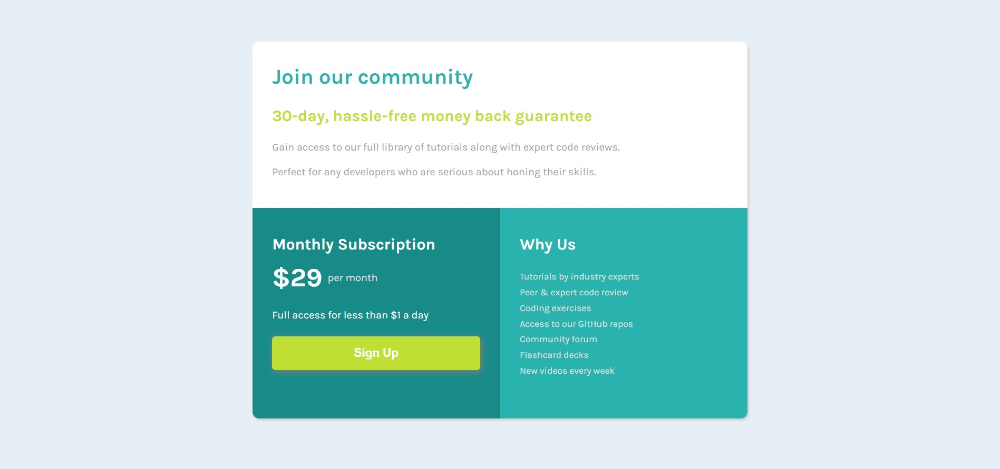

# Frontend Mentor - Single price grid component

**To do this challenge, you need a basic understanding of HTML and CSS.**

## The challenge

Your users should be able to:

- View the optimal layout for the component depending on their device's screen size
- See a hover state on desktop for the Sign Up call-to-action

Disclaimer: css grid isn't my daily bread but I tried to do this exercise anyways. I would rather use flexbox, its easier to maintain the site in my opinion
