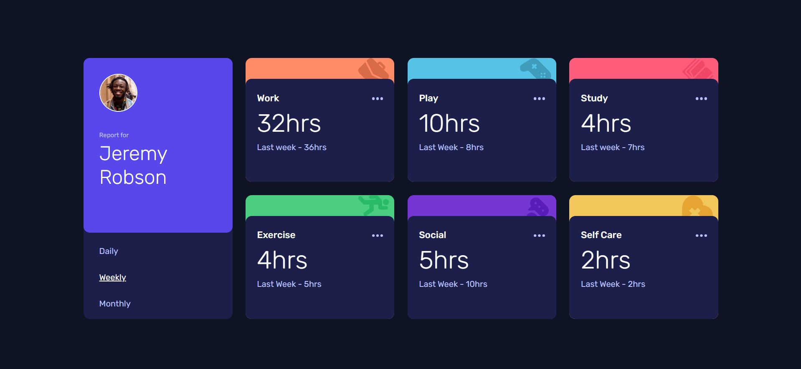
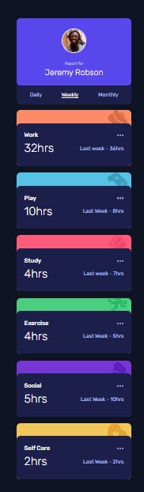

# Frontend Mentor - Time tracking dashboard

## The challenge

Your challenge is to build out this dashboard and get it looking as close to the design as possible.

You can use any tools you like to help you complete the challenge. So if you've got something you'd like to practice, feel free to give it a go.

If you would like to practice working with JSON data, we provide a local `data.json` file for the activities. This means you'll be able to pull the data from there instead of using the content in the `.html` file.

